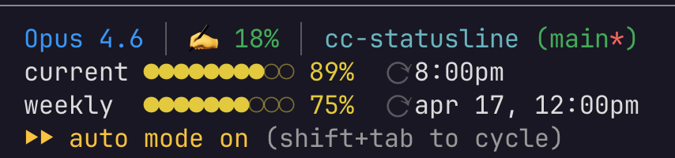

# claudehud



```bash
# macOS / Linux
curl -fsSL https://raw.githubusercontent.com/fyko/claudehud/main/install.sh | sh
```

```powershell
# Windows
irm https://raw.githubusercontent.com/fyko/claudehud/main/install.ps1 | iex
```

A Rust rewrite of my personal Claude Code statusline bash script. Renders in ~2.6ms instead of ~437ms by replacing bash interpreter startup + multiple `jq`/`git` subprocess calls with a compiled binary and an mmap-backed git status daemon.

Inspired by [kamranahmedse/claude-statusline](https://github.com/kamranahmedse/claude-statusline).

## Status incidents

When `status.claude.com` reports an active incident (or in-progress scheduled maintenance), `claudehud` emits a hyperlinked line directly below line 1:

```
Elevated API errors · started 12m ago    +1 more
```

The daemon polls `https://status.claude.com/history.atom` every 5 minutes using a conditional GET, so most hits return 304 Not Modified. When an incident is active, the most-recently-updated entry is shown; the `+N more` suffix appears when more than one incident or in-progress maintenance is active and links to the main status page. The line disappears automatically once every incident transitions to Resolved or Completed.

The daemon stores the current representative incident at `/tmp/clhud-incidents.bin` (408 bytes, seqlock-protected). If the daemon isn't running, the line simply doesn't appear — this degrades silently, like the git cache.

## Pipe-extension segments

Declare arbitrary shell commands in `~/.config/claudehud/config.toml` (macOS/Linux) or `%APPDATA%\claudehud\config.toml` (Windows). The daemon runs each command on its interval and caches the output; the client reads from cache on every render with no subprocess overhead.

```toml
[[segment]]
name     = "kube-ctx"
cmd      = "kubectl config current-context"
interval = "30s"
position = "after-branch"

[[segment]]
name     = "aws-profile"
cmd      = "aws configure get profile"
interval = "60s"
position = "end-line-1"
max_bytes     = 32    # default 64, max 128
timeout       = "2s"  # kill if command exceeds this; default 5s
show_on_error = false # show stderr on nonzero exit? default false
```

### Positions

| `position` value | Comfortable layout | Condensed layout |
|------------------|--------------------|------------------|
| `before-model` | before model name, line 1 | before model name |
| `after-branch` | after dir/branch, line 1 | after dir/branch |
| `end-line-1` | end of line 1 | end of line 1 |
| `before-rate` | before rate-limit bars | **omitted** |
| `line-2` | second newline block | **omitted** |
| `end-line-2` | end of second newline block | **omitted** |

### Security

> **Warning:** pipe-extension commands run with the daemon's privileges and inherit its environment. Only put trusted commands in your config file.

- Commands are split on whitespace and passed directly as `argv` — **not** through a shell. To use shell features (pipes, redirects, variable expansion), write `bash -c '...'` or `sh -c '...'` explicitly.
- On Unix, the daemon refuses to load a config file that is world-writable (`mode & 0o002 != 0`). A warning is printed to stderr and no segments run.
- Command output is truncated to `max_bytes` bytes on a UTF-8 character boundary. ANSI escape sequences are stripped before display.
- Hot-reload: the daemon watches the config directory for changes and restarts schedulers automatically. **Known limitation:** on some platforms, atomically-renamed files (most editors) may take up to one extra second to pick up.

## Architecture

Two binaries in a Cargo workspace:

```
claudehud/
├── common/                 shared constants, FNV hash, seqlock read, git root detection, incidents layout
├── claudehud/              client binary — reads JSON from stdin, writes statusline to stdout
└── claudehud-daemon/       daemon — watches git repos reactively, polls status.claude.com, caches in mmap files
```

### IPC: mmap + seqlock

Instead of spawning `git` on every render, the daemon holds per-repo status in memory-mapped files at `/tmp/clhud-{fnv32(path)}.bin`. The client reads directly from the mmap — no sockets, no syscalls beyond `open` + `mmap`.

**Cache file layout (138 bytes):**

| Offset | Size | Field |
|--------|------|-------|
| 0 | 8 | `u64` seqlock counter (even = stable, odd = write in progress) |
| 8 | 1 | `u8` dirty flag |
| 9 | 1 | `u8` branch name length |
| 10 | 128 | `[u8; 128]` branch name (UTF-8) |

**Registration:** on first render for a new directory, the client writes a marker file to `/tmp/clhud-watch/{hash}` containing the absolute path. The daemon watches that directory via FSEvents (macOS) / inotify (Linux) and picks it up.

On Windows, cache files live under `%LOCALAPPDATA%\claudehud\cache\` instead of `/tmp/`. The filename pattern (`clhud-{hash}.bin`) is identical.

**Client read path:**
1. Hash the cwd with FNV-1a 32-bit
2. Try `open("/tmp/clhud-{hash}.bin")` + mmap
3. Seqlock read loop (spin on odd counter, fence on acquire)
4. If file missing: write registration marker, fall back to direct `git` subprocess once

**Daemon write path:**
1. Receive path from registrar
2. Walk up to find `.git` root
3. Watch `{root}/.git/index` and `{root}/.git/HEAD` via `notify`
4. On FS event: re-run git status, seqlock-write to mmap file

## Benchmark

Measured with `hyperfine` (500 runs, 20 warmup) on an M-series Mac, feeding a realistic JSON payload:

```
Benchmark 1: bash statusline.sh
  Time (mean ± σ):     436.9 ms ±   8.2 ms    [User: 312.1 ms, System: 98.4 ms]

Benchmark 2: claudehud (warm cache)
  Time (mean ± σ):       2.6 ms ±   0.7 ms    [User: 0.9 ms, System: 1.3 ms]

Summary
  claudehud ran ~168× faster than bash statusline.sh
```

The first render for a new directory hits the git fallback (~9ms). All subsequent renders use the mmap cache.

Both binaries combined weigh 878 KB vs the 8.1 KB bash script — 108× larger, 168× faster, net efficiency gain of ~1.6× (168 / 106).

## Build

Requires Rust 1.70+ and Cargo.

```bash
cargo build --release
```

Binaries land at `target/release/claudehud` and `target/release/claudehud-daemon`.

On Windows, builds use the MSVC toolchain. The daemon's `windows_subsystem = "windows"` cfg only applies in `--release` mode — debug builds keep the console window so developers can see stdout/stderr.

```bash
# install
cp target/release/claudehud ~/.local/bin/
cp target/release/claudehud-daemon ~/.local/bin/
```

## Configuration

### Layout

Two render layouts: `comfortable` (default) and `condensed`. Set with the `CLAUDEHUD_LAYOUT` environment variable.

```bash
CLAUDEHUD_LAYOUT=condensed
```

Comfortable renders the HUD across multiple lines with full bars and a blank gap before rate limits:

```
Opus 4.7 (1M context) │ ✍️ 4% │ claudehud (main*)

current ○○○○○○○○○○   9% ⟳ 10:50am
weekly  ●○○○○○○○○○  12% ⟳ apr 25, 7:00pm
```

Condensed collapses everything onto a single line, with shorter rate-limit bars (4 dots) inline:

```
Opus 4.7 │ ✍️ 4% │ claudehud(main*) │ ○○○○ 5h 9% ⟳ 10:50am │ ○○○○ 7d 12% ⟳ apr 25, 7:00pm
```

On API billing (no `rate_limits` block from the harness), a 💰 segment with `cost.total_cost_usd` replaces the rate-limit rows:

```
Opus 4.7 (1M context) │ ✍️ 3% │ 💰 $0.13 │ claudehud (main*)
```

The segment is hidden when the field is missing or `$0`, and also hidden whenever `rate_limits` is present — plan users see an estimated cost from the harness, not actual spend, so showing it would be misleading. Tiered color: green &lt; $1, yellow &lt; $5, orange &lt; $20, red ≥ $20.

Active incidents still render on their own line below row 1 in both layouts.

Unknown values (`CLAUDEHUD_LAYOUT=foo`) print a warning to stderr and fall back to `comfortable`.

### Claude Code

Run `claudehud install` to wire the statusLine into `~/.claude/settings.json`:

```bash
claudehud install            # prompts if a statusLine already exists
claudehud install --force    # overwrite without prompting
claudehud install --dry-run  # print the resulting JSON without writing
```

`claudehud install --help` lists all flags. Respects `$CLAUDE_CONFIG_DIR` and
accepts `--settings <path>` to point at a non-default settings file.

To upgrade, run `claudehud update` — it re-invokes the official install script
(idempotent, no-ops if already at the latest tag). Use `claudehud update --check`
to compare versions without downloading.

Or set it by hand:

```json
{
  "statusLine": {
    "command": "\"$HOME/.local/bin/claudehud\" render"
  }
}
```

### Daemon (macOS launchd)

Create `~/Library/LaunchAgents/com.claudehud.daemon.plist`:

```xml
<?xml version="1.0" encoding="UTF-8"?>
<!DOCTYPE plist PUBLIC "-//Apple//DTD PLIST 1.0//EN"
  "http://www.apple.com/DTDs/PropertyList-1.0.dtd">
<plist version="1.0">
<dict>
  <key>Label</key>
  <string>com.claudehud.daemon</string>
  <key>ProgramArguments</key>
  <array>
    <string>/Users/YOUR_USERNAME/.local/bin/claudehud-daemon</string>
  </array>
  <key>RunAtLoad</key>
  <true/>
  <key>KeepAlive</key>
  <true/>
  <key>StandardOutPath</key>
  <string>/tmp/claudehud-daemon.log</string>
  <key>StandardErrorPath</key>
  <string>/tmp/claudehud-daemon.err</string>
</dict>
</plist>
```

```bash
launchctl load ~/Library/LaunchAgents/com.claudehud.daemon.plist
```

### Daemon (Linux systemd)

```ini
# ~/.config/systemd/user/claudehud-daemon.service
[Unit]
Description=claudehud git cache daemon

[Service]
ExecStart=%h/.local/bin/claudehud-daemon
Restart=always

[Install]
WantedBy=default.target
```

```bash
systemctl --user enable --now claudehud-daemon
```

### Daemon (Windows Task Scheduler)

`install.ps1` registers a per-user Task Scheduler entry named `claudehud-daemon` that runs at logon, hidden, with no admin required. The action invokes `%LOCALAPPDATA%\Programs\claudehud\claudehud-daemon.exe` and Task Scheduler restarts the daemon up to 3 times if it crashes.

Inspect or modify the registration:

```powershell
schtasks /Query /TN claudehud-daemon /XML
```

Uninstall:

```powershell
schtasks /Delete /TN claudehud-daemon /F
```

## Dependencies

| Crate | Used by | Purpose |
|-------|---------|---------|
| `memmap2` | client + daemon | memory-mapped file I/O |
| `serde` + `serde_json` | client + daemon + common | JSON + TOML deserialization |
| `toml` | client + daemon + common | parse `config.toml` for pipe-extension segments |
| `time` | client | local timezone formatting |
| `notify` | daemon | FSEvents/inotify filesystem watching |
| `crossbeam-channel` | daemon | multi-producer channel between registrar and watcher threads |
| `ureq` | daemon | HTTPS client for status.claude.com |
| `roxmltree` | daemon | Atom feed parser |
| `libc` | daemon (Unix) | SIGKILL for segment command timeout enforcement |
