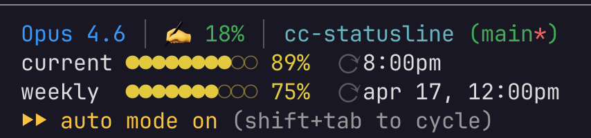

# claudehud



```bash
# macOS / Linux
curl -fsSL https://raw.githubusercontent.com/fyko/claudehud/main/install.sh | sh
```

```powershell
# Windows
irm https://raw.githubusercontent.com/fyko/claudehud/main/install.ps1 | iex
```

A Rust rewrite of my personal Claude Code statusline bash script. Renders in ~2.6ms instead of ~437ms by replacing bash interpreter startup + multiple `jq`/`git` subprocess calls with a compiled binary and an mmap-backed git status daemon.

Inspired by [kamranahmedse/claude-statusline](https://github.com/kamranahmedse/claude-statusline).

## Status incidents

When `status.claude.com` reports an active incident (or in-progress scheduled maintenance), `claudehud` emits a hyperlinked line directly below line 1:

```
Elevated API errors · started 12m ago    +1 more
```

The daemon polls `https://status.claude.com/history.atom` every 5 minutes using a conditional GET, so most hits return 304 Not Modified. When an incident is active, the most-recently-updated entry is shown; the `+N more` suffix appears when more than one incident or in-progress maintenance is active and links to the main status page. The line disappears automatically once every incident transitions to Resolved or Completed.

The daemon stores the current representative incident at `/tmp/clhud-incidents.bin` (408 bytes, seqlock-protected). If the daemon isn't running, the line simply doesn't appear — this degrades silently, like the git cache.

## Autoupdate

The daemon keeps itself current. Roughly every 5 minutes it asks `api.github.com` for the latest release using a conditional GET (so most hits return 304 Not Modified). When a newer release exists, it downloads both binaries, verifies each against its `.sha256` sidecar, swaps them into place, and restarts itself via launchd or systemd. For a few minutes after an update the client shows `updated to vX.Y.Z` under line 1.

Like everything else here, it degrades silently: if the daemon isn't running or a check fails, nothing happens and the installed version stays put.

**Opt out.** Install with `CLAUDEHUD_NO_AUTOUPDATE=1`, or set `autoupdate=false` in `~/.config/claudehud/config`.

**Pin a version.** Install with `CLAUDEHUD_VERSION=vX.Y.Z` (persisted as `pin=vX.Y.Z` in the config). The daemon won't move off a pinned version.

Dev builds never self-update — only release binaries installed outside a `target/` directory do. Windows autoupdate is not yet implemented; the daemon no-ops there.

## Architecture

Two binaries in a Cargo workspace:

```
claudehud/
├── common/                 shared constants, FNV hash, seqlock read, git root detection, incidents layout
├── claudehud/              client binary — reads JSON from stdin, writes statusline to stdout
└── claudehud-daemon/       daemon — watches git repos reactively, polls status.claude.com, caches in mmap files
```

### IPC: mmap + seqlock

Instead of spawning `git` on every render, the daemon holds per-repo status in memory-mapped files at `/tmp/clhud-{fnv32(path)}.bin`. The client reads directly from the mmap — no sockets, no syscalls beyond `open` + `mmap`.

**Cache file layout (138 bytes):**

| Offset | Size | Field |
|--------|------|-------|
| 0 | 8 | `u64` seqlock counter (even = stable, odd = write in progress) |
| 8 | 1 | `u8` dirty flag |
| 9 | 1 | `u8` branch name length |
| 10 | 128 | `[u8; 128]` branch name (UTF-8) |

**Registration:** on first render for a new directory, the client writes a marker file to `/tmp/clhud-watch/{hash}` containing the absolute path. The daemon watches that directory via FSEvents (macOS) / inotify (Linux) and picks it up.

On Windows, cache files live under `%LOCALAPPDATA%\claudehud\cache\` instead of `/tmp/`. The filename pattern (`clhud-{hash}.bin`) is identical.

**Client read path:**
1. Hash the cwd with FNV-1a 32-bit
2. Try `open("/tmp/clhud-{hash}.bin")` + mmap
3. Seqlock read loop (spin on odd counter, fence on acquire)
4. If file missing: write registration marker, fall back to direct `git` subprocess once

**Daemon write path:**
1. Receive path from registrar
2. Walk up to find `.git` root
3. Watch `{root}/.git/index` and `{root}/.git/HEAD` via `notify`
4. On FS event: re-run git status, seqlock-write to mmap file

## Benchmark

Measured with `hyperfine` (500 runs, 20 warmup) on an M-series Mac, feeding a realistic JSON payload:

```
Benchmark 1: bash statusline.sh
  Time (mean ± σ):     436.9 ms ±   8.2 ms    [User: 312.1 ms, System: 98.4 ms]

Benchmark 2: claudehud (warm cache)
  Time (mean ± σ):       2.6 ms ±   0.7 ms    [User: 0.9 ms, System: 1.3 ms]

Summary
  claudehud ran ~168× faster than bash statusline.sh
```

The first render for a new directory hits the git fallback (~9ms). All subsequent renders use the mmap cache.

Both binaries combined weigh 878 KB vs the 8.1 KB bash script — 108× larger, 168× faster, net efficiency gain of ~1.6× (168 / 106).

## Build

Requires Rust 1.70+ and Cargo.

```bash
cargo build --release
```

Binaries land at `target/release/claudehud` and `target/release/claudehud-daemon`.

On Windows, builds use the MSVC toolchain. The daemon's `windows_subsystem = "windows"` cfg only applies in `--release` mode — debug builds keep the console window so developers can see stdout/stderr.

```bash
# install
cp target/release/claudehud ~/.local/bin/
cp target/release/claudehud-daemon ~/.local/bin/
```

## Configuration

### Layout

The HUD is a single line. Rather than squeeze every rate-limit window in, it
shows one at a time in a rotating slot — a full bar plus a countdown, cycling
every 8 seconds:

```
Opus 4.7 (1M) high │ ctx 4% │ claudehud(main*) │ ○○○○○○○○○○ 5h 9% ⟳ 2h11m
```

Any window at 90% or above pins the slot and stops the rotation, so a nearly
spent budget can't hide for two turns of the wheel. The rotation is derived
from the clock, not a counter, so every open session shows the same window at
the same moment — see [`refreshInterval`](#claude-code) for keeping it moving
while the session is idle.

The model segment carries a `⚡` when fast mode is on, `(1M)` in place of the
harness's own parenthetical for an extended context window, and the reasoning
effort after the name, colored by tier: `medium` green, `high` yellow, `xhigh`
orange, `max` red, `low` dim.

On API billing (no `rate_limits` block from the harness), a 💰 segment with `cost.total_cost_usd` replaces the rate-limit rows:

```
Opus 4.7 (1M context) high │ ctx 3% │ 💰 $0.13 │ claudehud (main*)
```

The segment is hidden when the field is missing or `$0`, and also hidden whenever `rate_limits` is present — plan users see an estimated cost from the harness, not actual spend, so showing it would be misleading. Tiered color: green &lt; $1, yellow &lt; $5, orange &lt; $20, red ≥ $20.

Active incidents render on their own line below the main row. Anything running 24 hours or longer collapses into a `+N ongoing (24h+)` breadcrumb.

The context percentage honors `CLAUDE_CODE_AUTO_COMPACT_WINDOW`: when you cap
auto-compact below the model's window, the percentage is measured against the
cap you'll actually hit, not the full window.

### Fable weekly cap

On Max plans, Fable 5 draws on up to 50% of your weekly allowance and gets its own window. Claude Code's statusline payload doesn't carry that window — only the five-hour and seven-day ones — so the daemon has to fetch it from `/api/oauth/usage` using the OAuth token Claude Code already stores (macOS keychain, `~/.claude/.credentials.json` elsewhere).

Because that's the only part of claudehud that touches your credentials, it's off unless you ask for it:

```bash
echo 'fable=true' >> ~/.config/claudehud/config   # %APPDATA%\claudehud\config on Windows
```

The daemon then polls every 5 minutes and writes `percent` + reset time to `/tmp/clhud-fable`; the client renders it as a third stop in the rotating slot:

```
current ●●●●●●●●●○  96% ⟳ 10:19am
weekly  ●●●●●○○○○○  52% ⟳ jul 29, 8:59pm
fable   ●●●●●○○○○○  51% ⟳ jul 29, 9:00pm
```

```
Opus 4.7 │ ✍️ 4% │ claudehud(main*) │ ●●●● 5h 96% │ ●●○○ 7d 52% │ ●●○○ fbl 51%
```

The row disappears once the window it describes has reset, so a stopped daemon shows nothing rather than a stale number. Everything else degrades silently too: no token, an expired token, or a plan without a Fable window just means no row.

### Claude Code

Run `claudehud install` to wire the statusLine into `~/.claude/settings.json`:

```bash
claudehud install            # prompts if a statusLine already exists
claudehud install --force    # overwrite without prompting
claudehud install --dry-run  # print the resulting JSON without writing
```

`claudehud install --help` lists all flags. Respects `$CLAUDE_CONFIG_DIR` and
accepts `--settings <path>` to point at a non-default settings file.

To upgrade, run `claudehud update` — it re-invokes the official install script
(idempotent, no-ops if already at the latest tag). Use `claudehud update --check`
to compare versions without downloading.

Or set it by hand:

```json
{
  "statusLine": {
    "type": "command",
    "command": "\"$HOME/.local/bin/claudehud\" render",
    "refreshInterval": 2
  }
}
```

`refreshInterval` re-runs the command every N seconds on top of Claude Code's
event-driven updates. Without it the HUD freezes whenever the session goes
quiet, which strands everything time-based: the rate-limit countdowns, the
rotating usage slot, and incident ages. `claudehud install` writes it for you.

### Daemon (macOS launchd)

Create `~/Library/LaunchAgents/com.claudehud.daemon.plist`:

```xml
<?xml version="1.0" encoding="UTF-8"?>
<!DOCTYPE plist PUBLIC "-//Apple//DTD PLIST 1.0//EN"
  "http://www.apple.com/DTDs/PropertyList-1.0.dtd">
<plist version="1.0">
<dict>
  <key>Label</key>
  <string>com.claudehud.daemon</string>
  <key>ProgramArguments</key>
  <array>
    <string>/Users/YOUR_USERNAME/.local/bin/claudehud-daemon</string>
  </array>
  <key>RunAtLoad</key>
  <true/>
  <key>KeepAlive</key>
  <true/>
  <key>StandardOutPath</key>
  <string>/tmp/claudehud-daemon.log</string>
  <key>StandardErrorPath</key>
  <string>/tmp/claudehud-daemon.err</string>
</dict>
</plist>
```

```bash
launchctl load ~/Library/LaunchAgents/com.claudehud.daemon.plist
```

### Daemon (Linux systemd)

```ini
# ~/.config/systemd/user/claudehud-daemon.service
[Unit]
Description=claudehud git cache daemon

[Service]
ExecStart=%h/.local/bin/claudehud-daemon
Restart=always

[Install]
WantedBy=default.target
```

```bash
systemctl --user enable --now claudehud-daemon
```

### Daemon (Windows Task Scheduler)

`install.ps1` registers a per-user Task Scheduler entry named `claudehud-daemon` that runs at logon, hidden, with no admin required. The action invokes `%LOCALAPPDATA%\Programs\claudehud\claudehud-daemon.exe` and Task Scheduler restarts the daemon up to 3 times if it crashes.

Inspect or modify the registration:

```powershell
schtasks /Query /TN claudehud-daemon /XML
```

Uninstall:

```powershell
schtasks /Delete /TN claudehud-daemon /F
```

## Dependencies

| Crate | Used by | Purpose |
|-------|---------|---------|
| `memmap2` | client + daemon | memory-mapped file I/O |
| `serde` + `serde_json` | client | deserialize Claude Code JSON payload |
| `time` | client | local timezone formatting |
| `notify` | daemon | FSEvents/inotify filesystem watching |
| `crossbeam-channel` | daemon | multi-producer channel between registrar and watcher threads |
| `ureq` | daemon | HTTPS client for status.claude.com |
| `roxmltree` | daemon | Atom feed parser |

`common` has no external dependencies.
